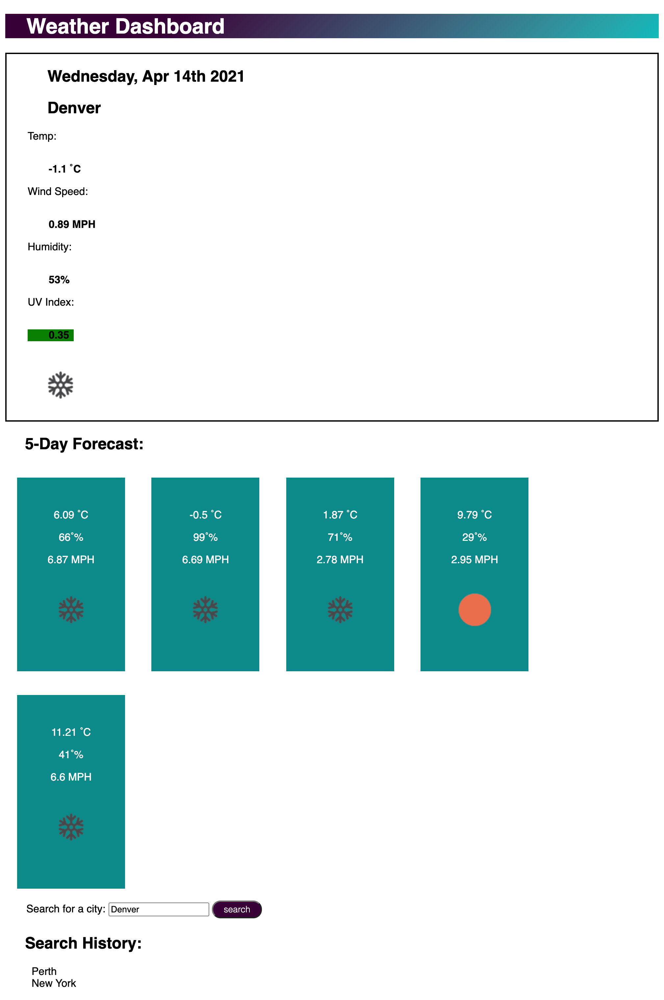

# 06 Server-Side APIs: Weather Dashboard 
## Description

For this project I created a weather dashboard what runs in the browser. 

Using the OpenWeather One Call and Current Weather Api, I was able to retrieve weather data for cities.

When a city is searched for the current and future conditions for that city is displayed. 

When the current conditions for the city are displayed the city name, date, icon represented the weather conditions, the temperature, the humidity, the wind speed and the UV index are all displayed. 

The UV index also has a color the indicates when the conditions are favorable (green), moderate (orange) and severe (red). 

The 5 day forcast for the searched city is displayed with teh date, icon represented the weather conditions, the temperature, the wind speed, and the humidity. 

## Problems 
After a city is searched for it only appears as a list item under Search History after the page has been refreshed. If a city is misspelt nothing loads on the page.

When the city is click on in the search history the current weather conditions do not reappear. 

## Usage
 

[Link to deployed application](https://harmane4.github.io/Weather-Dashboard/)

## Credits

Websites used to create application: 

[JavaScript Weather App Tutorial using Openweathermap API for beginners | Javascript tutorial](https://www.youtube.com/watch?v=GXrDEA3SIOQ&t=4s)

[Fetching icons from OpenWeather API](https://dev.to/mtee/day-63-fetching-icons-from-open-weather-23lh)

[Beginner Vanilla Javascript Project Tutorial](https://www.youtube.com/watch?v=Ttf3CEsEwMQ)

## License 
[MIT](https://choosealicense.com/licenses/mit/)
